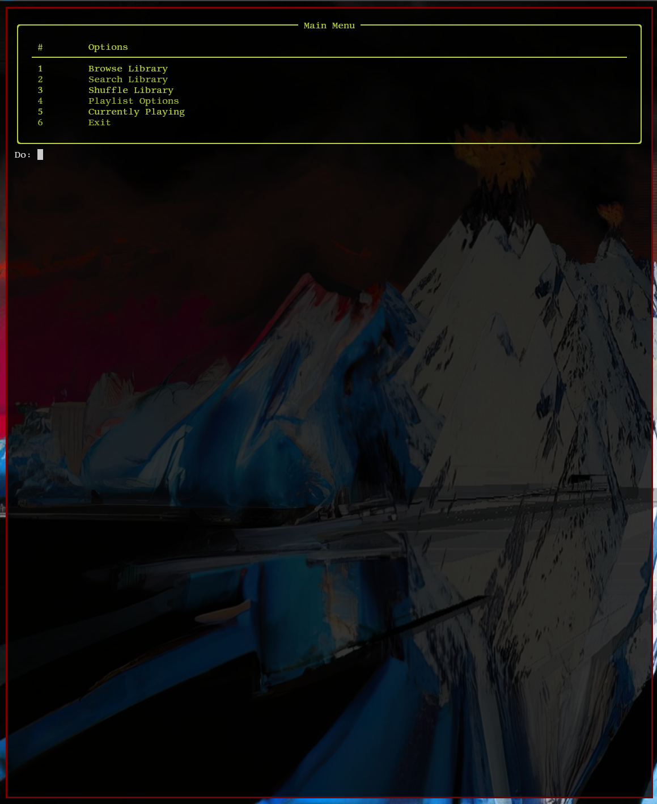
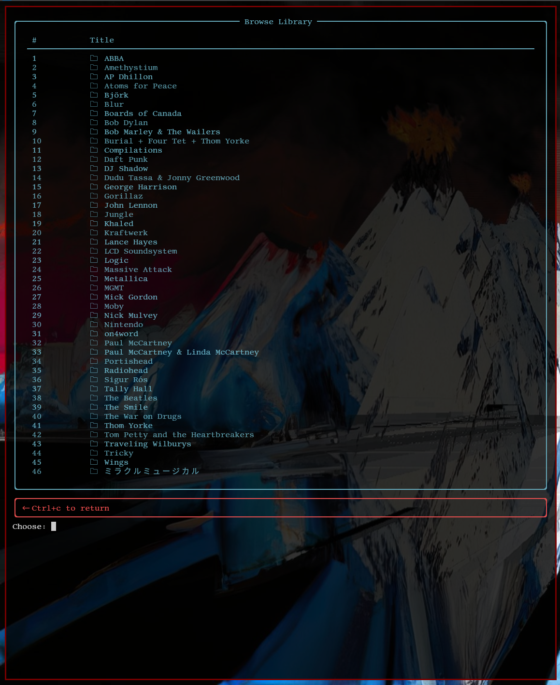
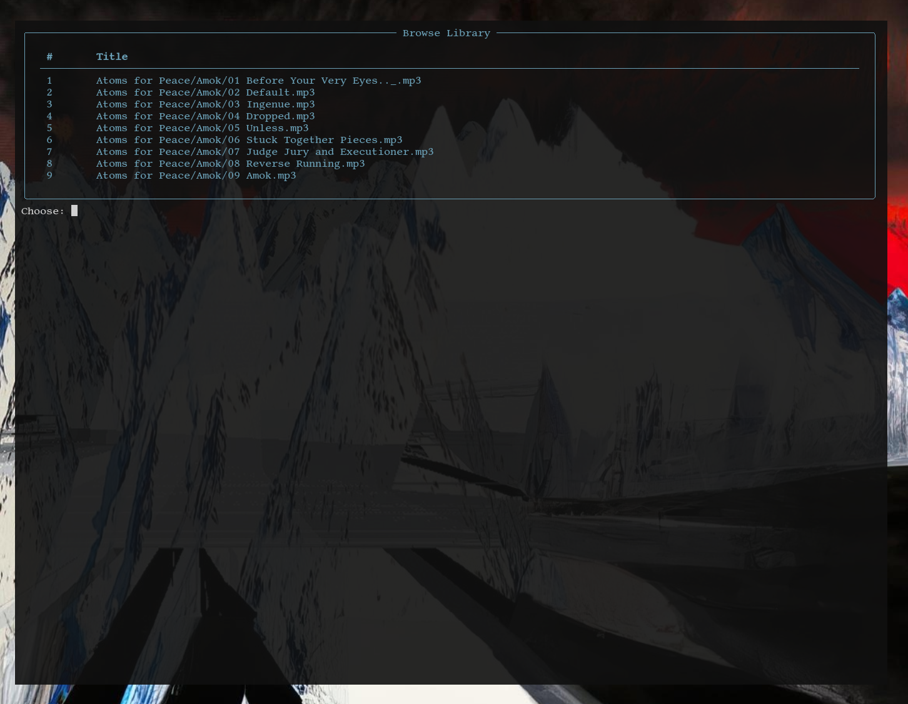
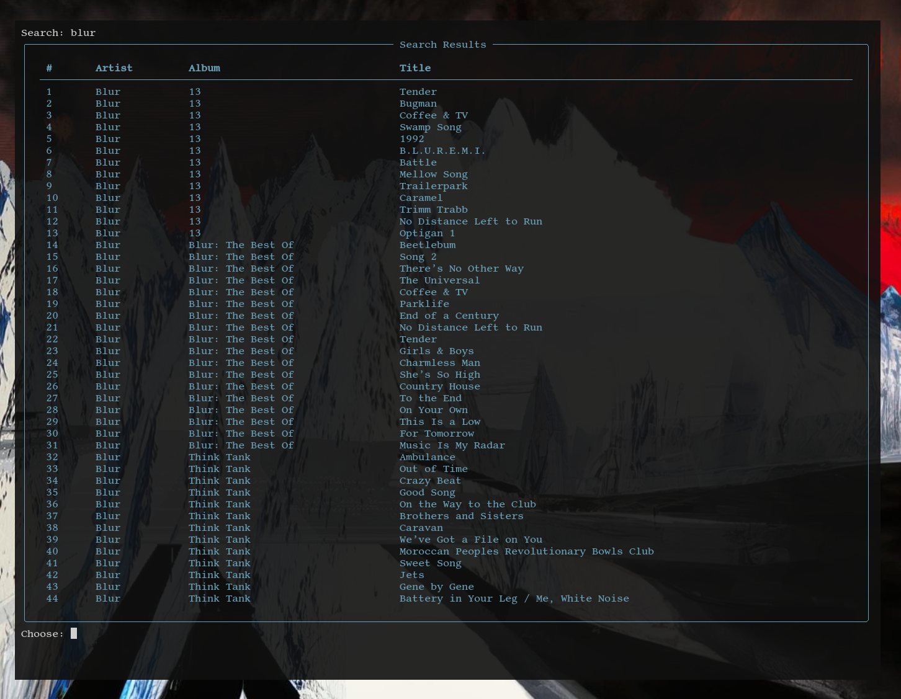
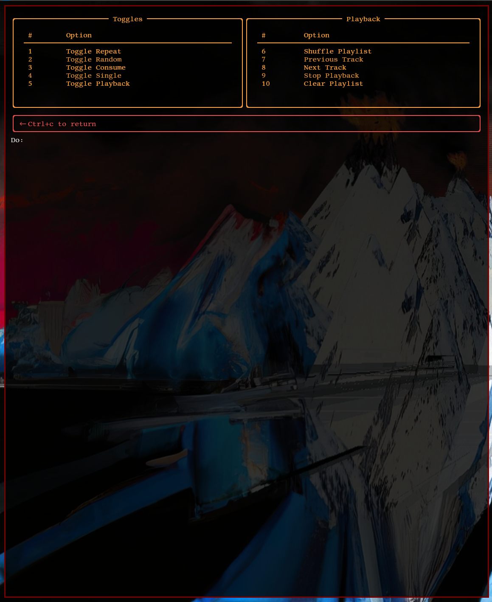
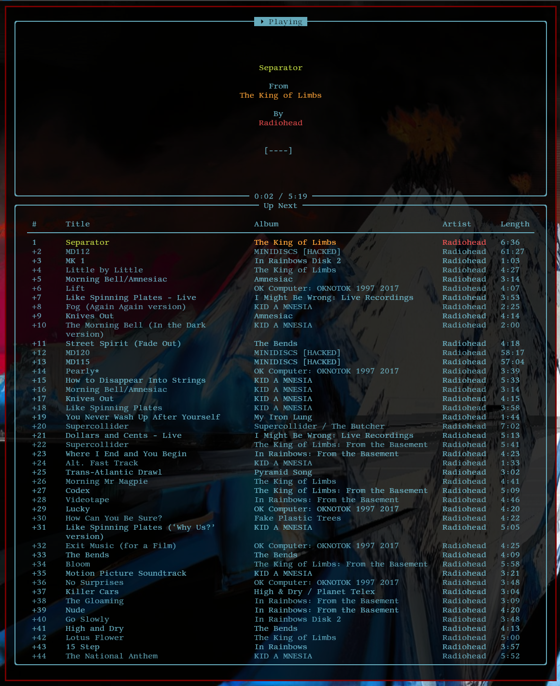

# dpm
dpm is a TUI frontend to MPD
## Features
The feature set, at present, is somewhat limited. Right now, it can:
- browse your library
- search for media
- manage playlist settings
- shuffle your library
- view the current playlist
## Limitations
- browsing works only with a 3-level directory structure (i.e. artist -> album -> songs)
- managing playlist settings does not include managing the queue
## Issues
- if left idle for too long, the app loses connection to MPD
# Installation
- TODO
## Requirements
- dpm requires a working installation of MPD.
  - For now, if your MPD setup has a different hostname and port number, change it in `client.py`. The default hostname is `"localhost"` and port number is `6600`. 
## Dependencies
- Rich (install with `pip install rich`)
# Usage
## Navigation
- Ctrl+c is used to navigate backwards. For example, when browsing the library, inputting `Ctrl+c` will take you to the parent directory.
## Main Menu
- Simply input the index corresponding to the desired task. For example, if browsing the library is at index 1, input a 1. 
## Browsing the library
- The app will present a list of folders. To navigate, input the letter 'v' followed by the corresponding index. For example, if the artist "Kraftwerk" is at index 20, input "v 20" to view its subdirectories.
- Adding to the queue followes the same procedure. To add an artist, album or track to the queue, input 'a' followed by the corresponding index. For example, if the album '13' is at index 1, input "a 20" to add it to the queue.
## Searching
- Input a search query. The app will return a table of search results. To add something to the queue, input 'a' followed by the corresponding index, as detailed above.
## Playlist Options
- Simple input the index corresponding to the desired operation. For example, if shuffling the playlist is at index 6, simply input a 6.
# Screenshots
## Main Menu

## Browsing the Library

## Searching the Library

## Playlist Options

## Currently Playing

