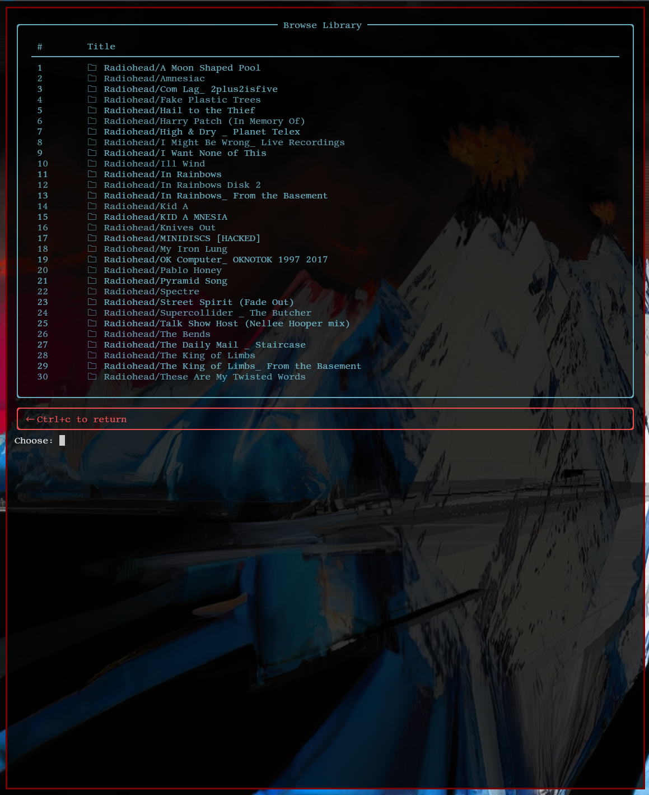

# dpm
dpm is a TUI frontend to MPD
## Features
The feature set, at present, is somewhat limited. Right now, it can:
- browse your library
- search for media
- manage playlist settings
- shuffle your library
- view the current playlist
## Limitations
- browsing works only with a 3-level directory structure (i.e. artist -> album -> songs)
- managing playlist settings does not include managing the queue
## Issues
- if left idle for too long, the app loses connection to MPD
# Installation
- For now, clone the repository and run `main.py`
## Dependencies
- Rich (install with `pip install rich`)
- python-mpd2 (install with `pip install python-mpd2`)
- MPD (default hostname is `"localhost"` and port is `6600`. Change this is client.py, if desired)
# Usage
Refer to help.md
# Screenshots
TODO: Update screenshots
## Main Menu

## Browsing the Library

## Searching the Library

## Playlist Options

## Currently Playing

