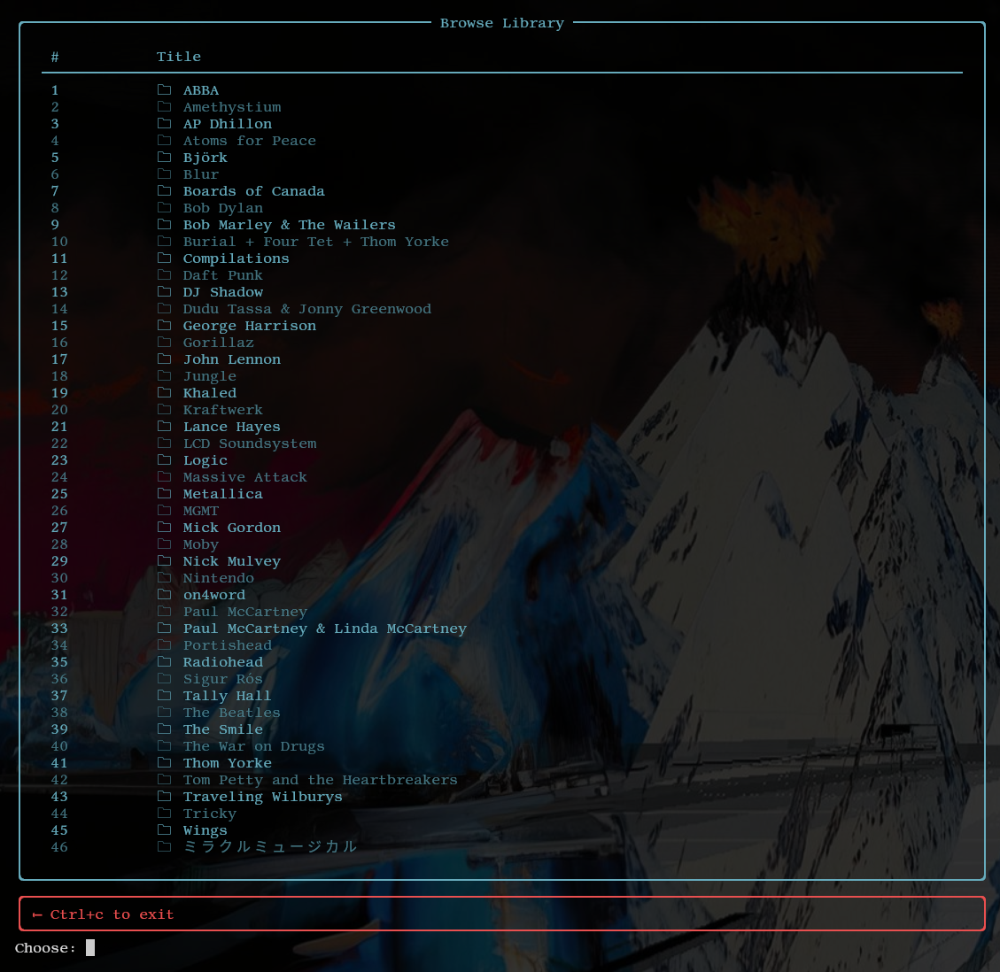

  

dpm is just one more terminal frontend for MPD

## Features
The feature set, at present, is somewhat limited. Right now, it can:
- browse your library
- search for media
- manage playlist settings
- shuffle your library
- view the current playlist

# Installation
- Download the executable. Place in your $PATH (i.e. ~/.local/bin)

# Usage
Input `dpm` followed by one of the following arguments:
- browse (b)
- search (f)
- shuffle (s)
- options (o)
- current (c)
- help (h)

## browse
Browse the library.  
**Usage**: Input `dpm browse` or `dpm b` to access the browsing interface:
- There are two kinds of valid operations here: (a)dd to queue, or (v)iew directory.

### Adding to queue
- Input 'a', followed by the index that corresponds to the artist/album/title you want to add to the queue. For example, to add an album at index 24, you would input "a 24".

### Viewing a directory
- Input 'v', followed by the index that corresponds to the artist/ablum you want to view. For example, to view everything under the folder at 13, you would input "v 13".

## search
Search the library.  
**Usage**: Input `dpm search` or `dpm f` (f for find) to access the search interface:
- You will be prompted for a search term. Enter whatever you want to search here.
- The app will display a table of search results. Here, the only valid operation is 'a'; its operation is the same as detailed above. 

## shuffle
Shuffle the entire library and start playing.  
**Usage**: Input `dpm shuffle` or `dpm s`

## options
Manage playlist settings.  
**Usage**: Input `dpm options` or `dpm o`. Optionally, follow this with one of the following arguments:
- r (toggle repeat)
- z (toggle random)
- c (toggle consume)
- o (toggle single)
- t (toggle playback)
- s (shuffle current playlist)
- p (previous song)
- n (next song)
- x (stop playback)
- e (clear playlist)
For example, input `dpm options x` or `dpm o x` to stop playback.

## current
View the current playlist, including the currently playing song.  
**Usage**: input `dpm current` or `dpm c`

# TODO
- Configuration options
- Support for playlists
- Better interface consistency
- Cropping the current playlist (as in `mpc crop`)
- Playlist options reworking
- Manipulate the positions of songs in the current queue
- The currently playing screen needs a bit of reworking

# Limitations
- Browsing works only with a 3-level directory structure (i.e. artist -> album -> songs). The first 2 levels need to be folders.

# Issues
- If left idle for too long, the app loses connection to MPD.

# Screenshots
## Browsing the Library

## Searching the Library

## Playlist Options

## Currently Playing

